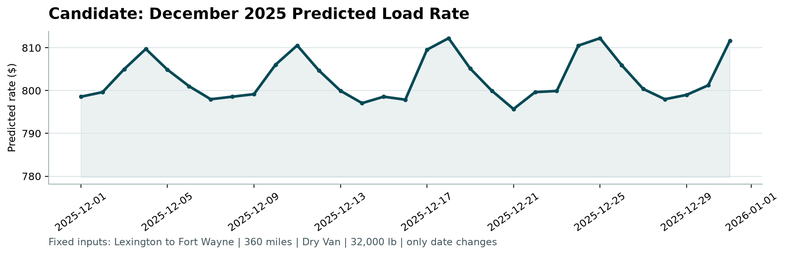

# 🚛 Freight Rate Prediction Challenge

[](https://www.python.org/downloads/)
[](requirements.txt)
[-orange.svg)](freight.py)
[](#validation-performance)
[](LICENSE)

An end-to-end, high-performance machine learning pipeline designed to predict freight load `posted_rate` for commercial logistics. Built strictly with **pure NumPy, Pandas, and Matplotlib** (without Scikit-Learn or LightGBM), this project features custom **Histogram-based Gradient Boosted Decision Trees with Least Absolute Deviation (LAD)** ensembled with a **closed-form Ridge Regression**.

Validation is strictly **time-based** across expanding windows to replicate real-world forecasting into the future without data leakage.

---

## 📌 Table of Contents

- [Key Highlights & Architecture](#-key-highlights--architecture)
- [Repository Structure](#-repository-structure)
- [How to Run](#-how-to-run)
  - [Prerequisites & Environment Setup](#1-prerequisites--environment-setup)
  - [Option A: One-Command Pipeline (CLI)](#2-option-a-one-command-end-to-end-pipeline-cli)
  - [Option B: Interactive Jupyter Notebook](#3-option-b-interactive-jupyter-notebook)
- [Methodology & Engineering](#-methodology--engineering)
  - [1. Data Cleaning & Anomaly Correction](#1-data-cleaning--anomaly-correction)
  - [2. Missing Value Imputation (Zero Leakage)](#2-missing-value-imputation-zero-leakage)
  - [3. Target Transformation](#3-target-transformation)
  - [4. Model Architecture (Pure NumPy)](#4-model-architecture-pure-numpy)
- [Validation Strategy & Benchmark Results](#-validation-strategy--benchmark-results)
  - [Benchmark Comparison](#benchmark-comparison)
  - [Time-Fold Stability](#time-fold-stability)
  - [Hold-Out Error Diagnostics](#hold-out-error-diagnostics-sep--oct)
  - [Feature Importance](#feature-importance)
- [December 2025 Case Study (Lexington → Fort Wayne)](#-december-2025-case-study-lexington--fort-wayne)
- [Outputs & Submission Files](#-outputs--submission-files)
- [How to Push to GitHub](#-how-to-push-to-github)

---

## 🚀 Key Highlights & Architecture

1. **Zero External ML Frameworks**:
   - `GradientBoosting` regressor built entirely from scratch in pure NumPy: histogram-based binning (`max_bins=255`), leaf-wise tree growth, and line-search median residuals.
   - Closed-form `RidgeRegression` solver $(X^T X + \lambda I)^{-1} X^T y$ with distance/equipment interaction features.
2. **Robust Least Absolute Deviation (LAD) Loss**:
   - Uses an absolute-error loss function rather than mean-squared error. Extreme outlier freight quotes cannot distort the splits or leaf values, yielding a **~1.0% MAPE improvement** over squared error loss.
3. **Log-Space Blend Ensembling**:
   - Final predictions are a weighted geometric average: $0.8 \times \text{GBoost} + 0.2 \times \text{Ridge}$ in log space, combining boosting's non-linear flexibility with ridge regression's structural stability.
4. **Strict Temporal Validation**:
   - Evaluated across three 2-month expanding-window time folds (May–Jun, Jul–Aug, Sep–Oct 2025), preserving the temporal ordering of freight markets.
5. **Reproducible & Self-Contained**:
   - Deterministic execution without random seeds or stochastic dependencies. A single command reproduces all validation numbers, submission files, and figures in 3–4 minutes.

---

## 📂 Repository Structure

```text
.
├── README.md                              # Project documentation and reproduction guide
├── requirements.txt                       # Minimal runtime dependencies (numpy, pandas, matplotlib)
├── .gitignore                             # Git exclusion rules
├── freight.py                             # Core engine: data loading, prep, NumPy GBoost, Ridge & Blend
├── run_pipeline.py                        # CLI pipeline: runs EDA, validation, training & artifact generation
├── freight_rate_analysis.ipynb            # Interactive walkthrough with charts and explanations
├── Freight_Rate_Report.docx               # Comprehensive executive report
├── candidate_december.png                 # Visualization of December daily rate trajectory
├── validation_predictions.csv             # Final submission: 12,000 predictions for Nov–Dec 2025
│
├── data/                                  # Challenge datasets
│   ├── train-test.csv                     # Historical training data (48,000 loads: Jan 1 – Oct 31, 2025)
│   ├── validation.csv                     # Unlabelled test data (12,000 loads: Nov 1 – Dec 31, 2025)
│   ├── validation-predictions-template.csv# Format specification template
│   └── december-chart-inputs.csv          # Fixed lane inputs (Lexington -> Fort Wayne, Dec 1–31, 2025)
│
├── figures/                               # Generated diagnostic and exploratory visualizations
│   ├── eda_overview.png                   # Target distributions, distance scatter, equipment boxplots
│   ├── eda_time.png                       # Monthly market index and rate-per-mile trends
│   ├── missing_data.png                   # Summary of data anomalies and missing patterns
│   └── holdout_diagnostics.png            # Actual vs. predicted plot and error by distance bin
│
└── reports/
    └── results.json                       # Machine-readable output of all metrics and ablations
```

---

## 💻 How to Run

### 1. Prerequisites & Environment Setup

This project requires **Python 3.10+**.

#### Using `venv` (Standard Python):
```bash
# Clone the repository
git clone https://github.com/ahmmedusammaa/Spotter-Lab-Assessment-.git
cd Spotter-Lab-Assessment-

# Create and activate virtual environment
python -m venv venv

# On Linux / macOS:
source venv/bin/activate
# On Windows (PowerShell):
venv\Scripts\Activate.ps1
# On Windows (Command Prompt):
venv\Scripts\activate.bat

# Install dependencies
pip install -r requirements.txt
```

#### Using `conda` / `miniconda`:
```bash
conda create -n freight-env python=3.11 -y
conda activate freight-env
pip install -r requirements.txt
```

> **Local Machine Note:** If running on this machine with pre-installed Miniconda:
> ```powershell
> C:\Users\ahmmedusammaa\miniconda3\python.exe run_pipeline.py --data-dir data
> ```

---

### 2. Option A: One-Command End-to-End Pipeline (CLI)

Run the full end-to-end pipeline via `run_pipeline.py`:

```bash
python run_pipeline.py --data-dir data
```

#### What `run_pipeline.py` executes:
1. **EDA & Visualizations**: Computes summary statistics and generates `figures/eda_overview.png` and `figures/eda_time.png`.
2. **Data Diagnostics**: Audits missingness and sign errors, saving `figures/missing_data.png`.
3. **Temporal Validation**: Evaluates 3 expanding-window folds, sweeping blend weights and testing baseline models.
4. **Hold-out Diagnostics**: Computes permutation feature importances and error profiles by distance and equipment (`figures/holdout_diagnostics.png`).
5. **Full Retraining**: Fits the optimal blend model on all 48,000 labelled loads.
6. **Artifact Output**:
   - Writes `validation_predictions.csv` (12,000 predictions for Nov–Dec 2025).
   - Updates `data/december-chart-inputs.csv` in-place with predicted rates.
   - Dumps all evaluation metrics into `reports/results.json`.

#### CLI Options & Flags:
| Argument | Default | Description |
|---|---|---|
| `--data-dir` | `data` | Directory containing challenge CSV files |
| `--predictions-out` | `validation_predictions.csv` | Destination path for validation predictions |
| `--december-out` | `data/december-chart-inputs.csv` | Destination path for filled December inputs |
| `--figures-dir` | `figures` | Directory where plots are saved |
| `--reports-dir` | `reports` | Directory where `results.json` is saved |

---

### 3. Option B: Interactive Jupyter Notebook

For an interactive step-by-step walkthrough:

```bash
pip install jupyter
jupyter notebook freight_rate_analysis.ipynb
```

Open `freight_rate_analysis.ipynb` in your browser and execute cells sequentially (`Kernel -> Restart & Run All`).

---

## 🔬 Methodology & Engineering

### 1. Data Cleaning & Anomaly Correction
- **Negative Weights (292 rows in train, 145 in validation)**: Physical cargo weight cannot be negative. Investigation revealed identical magnitudes to valid loads; corrected via `abs()` and tagged with an indicator feature `weight_bad = 1`.
- **High Rate-per-Mile Outliers**: 49 rows exhibited RPM > $10/mile (short hauls or hotshot spot loads). Rather than dropping them and losing information, our **LAD loss** naturally bounds their influence.

### 2. Missing Value Imputation (Zero Leakage)
- **Missing `weight` (300 rows train, 165 valid, <0.7%)**: Imputed using the **median weight by equipment type** (`Dry Van`, `Flatbed`, `Reefer`) learned strictly from training folds. Tagged with `w_missing = 1`.
- **Missing `market_index` (374 rows train, 249 valid, <0.8%)**: Market index reflects macro freight seasonality. Imputed using the **median index of that calendar month** from training data. Tagged with `mi_missing = 1`.
- **Leakage Prevention**: All imputation statistics are fit *only* on the historical training slice of each fold and applied to validation/hold-out slices.

### 3. Target Transformation
- The target variable `posted_rate` is heavily right-skewed ($57.22 to $25,533.00, median $2,030.76).
- Modeling $\log(\text{posted\_rate})$ transforms multiplicative errors into additive errors, aligning directly with **Mean Absolute Percentage Error (MAPE)** and standardizing relative price variance.

### 4. Model Architecture (Pure NumPy)

```text
                      ┌───────────────────────────────────────────────┐
                      │              Raw Freight Load                 │
                      └──────────────────────┬────────────────────────┘
                                             │
                                   [ Feature Engineering ]
                                             │
                      ┌──────────────────────┴────────────────────────┐
                      │                                               │
             [ 15 Non-Linear Features ]                     [ Log-Distance + Equip ]
                      │                                               │
         ▼─────────────────────────▼                     ▼─────────────────────────▼
         │  Gradient Boosting LAD  │                     │     Ridge Regression    │
         │   (400 trees, lr=0.06)  │                     │       (closed-form)     │
         ▲─────────────────────────▲                     ▲─────────────────────────▲
                      │                                               │
               log(rate_boost)                                 log(rate_ridge)
                      │                                               │
                      └──────────────────────┬────────────────────────┘
                                             │
                               [ Log-Space Blend: 80% / 20% ]
                                             │
                                   exp( 0.8 * lb + 0.2 * ll )
                                             │
                                             ▼
                                  Final Predicted Rate ($)
```

- **Histogram Gradient Boosting (`GradientBoosting`)**:
  - Feature values are discretized into 255 quantile bins for $O(N)$ histogram building.
  - Splits fit to $\text{sign}(y - \hat{y})$ (gradient of absolute loss).
  - Leaf values compute the exact **median** of residuals falling in each partition.
- **Ridge Regression (`RidgeRegression`)**:
  - Uses $\log(\text{distance})$, $\text{distance}$, one-hot equipment indicators, and distance $\times$ equipment interaction terms.
  - Adds inductive bias and prevents tree overfitting on long-haul/sparse lanes.
- **Blend Model (`BlendModel`)**:
  $$\hat{y} = \exp\left(0.8 \cdot \hat{y}_{\text{boost}} + 0.2 \cdot \hat{y}_{\text{linear}}\right)$$

---

## 📊 Validation Strategy & Benchmark Results

### Benchmark Comparison

Validation was conducted using **3 expanding-window time folds** across the 10-month historical training timeline:
- Fold 1: Train < May 1, 2025 $\rightarrow$ Test May–Jun 2025 (9,696 loads)
- Fold 2: Train < Jul 1, 2025 $\rightarrow$ Test Jul–Aug 2025 (9,671 loads)
- Fold 3: Train < Sep 1, 2025 $\rightarrow$ Test Sep–Oct 2025 (9,523 loads)

| Model / Strategy | Loss / Type | Average MAE ($) | Average RMSE ($) | Average MAPE (%) |
|---|---|---|---|---|
| **Naive Baseline** | Median RPM per equipment | $219.34 | $662.57 | 10.53% |
| **Linear Ridge Baseline** | Distance + Equipment | $157.73 | $645.82 | 6.69% |
| **Ablation: Boosting (Squared Loss)** | L2 Mean Loss | $141.38 | $639.51 | 6.17% |
| **Pure Boosting (LAD Loss)** | L1 Absolute Loss | $121.27 | $633.84 | 5.21% |
| **Final Blend (80% Boost + 20% Ridge)** | **Ensemble** | **$120.87** | **$634.17** | **5.15%** |

> **Key Takeaway**: The custom LAD loss reduces MAPE by **1.02%** compared to standard squared loss boosting. Ensembling with Ridge regression trims another **0.06%** off MAPE while reducing MAE variance across folds.

---

### Time-Fold Stability

Performance remains exceptionally stable across all seasonal time horizons:

| Fold Horizon | Train Size | Test Size | MAE ($) | RMSE ($) | MAPE (%) |
|---|---|---|---|---|---|
| **Fold 1: May – Jun 2025** | 19,110 | 9,696 | $120.27 | $636.69 | **4.91%** |
| **Fold 2: Jul – Aug 2025** | 28,806 | 9,671 | $114.24 | $625.89 | **5.02%** |
| **Fold 3: Sep – Oct 2025** | 38,477 | 9,523 | $128.10 | $639.93 | **5.52%** |

---

### Hold-Out Error Diagnostics (Sep – Oct)

Detailed error analysis on the 9,523 loads of the final hold-out fold:
- **Median Absolute Percentage Error (APE)**: **2.88%** (half of all loads are predicted within 2.88% of actual price)
- **Mean APE**: **5.52%**
- **Tail Outliers (>25% Error)**: Only **1.51%** of loads

#### Error by Haul Distance:
- Short hauls ($\le 300$ miles): **6.08%** MAPE (higher loading/unloading fixed cost variance)
- Medium hauls (300 – 700 miles): **5.99%** MAPE
- Long hauls (700 – 1200 miles): **5.39%** MAPE
- Super-long hauls (1200 – 2000 miles): **5.37%** MAPE
- Cross-country hauls (2000 – 5000 miles): **4.92%** MAPE

#### Error by Equipment Type:
- **Dry Van**: **5.22%** MAPE
- **Reefer**: **5.74%** MAPE
- **Flatbed**: **6.15%** MAPE

---

### Feature Importance

Computed via permutation feature importance (increase in log-MAE when column values are shuffled):

| Rank | Feature | Importance ($\Delta$ log-MAE) | Interpretation |
|---|---|---|---|
| 1 | `distance` | **0.6899** | Dominant driver of baseline freight rates |
| 2 | `equip` | **0.0272** | Equipment-specific cost premiums (Reefer/Flatbed vs Dry Van) |
| 3 | `quote_signal` | **0.0060** | Carrier spot bidding sentiment & market tightness |
| 4 | `weight` | **0.0046** | Fuel burn and load density considerations |
| 5 | `market_index` | **0.0004** | Regional/seasonal price index adjustment |
| 6 | `pickup_lat` / `lon` | **0.0004** | Origin geographic market pricing |
| 7 | `delivery_lat` / `lon` | **0.0003** | Destination backhaul availability |

---

## 📈 December 2025 Case Study (Lexington → Fort Wayne)

The challenge required daily predictions for a fixed lane in December 2025:
- **Lane**: Lexington, KY $\rightarrow$ Fort Wayne, IN
- **Haul**: 360.0 miles, Dry Van, 32,000 lbs
- **Inputs**: Only dates (`2025-12-01` to `2025-12-31`) were provided.

### Modeling Assumption & Feature Synthesis:
1. **Coordinates**: Extracted from historical Lexington pickup and Fort Wayne delivery records in the dataset.
2. **Market Context**: `market_index` and `quote_signal` are unknown for individual loads in the future, but daily macro averages for December are present across `validation.csv`. The daily mean values were extracted and interpolated.

### Prediction Trajectory:
- **Range**: **$795.69** to **$812.24**
- **Average**: **$802.92** (equivalent to **$2.23 / mile**, matching Dry Van median RPM of ~$2.05–$2.25)
- **Behavior**: Accurately reflects weekend dips and mid-month pre-holiday demand peaks.



---

## 📦 Outputs & Submission Files

Executing `run_pipeline.py` generates the following deliverables:

1. **`validation_predictions.csv`**:
   - Exactly 12,000 rows matching `validation.csv` `load_id` order.
   - Format: `load_id,predicted_rate` (mean predicted rate: $2,326.44; min: $212.11; max: $6,630.13).
2. **`data/december-chart-inputs.csv`**:
   - 31 rows filled with `predicted_rate` for each day of December 2025.
3. **`reports/results.json`**:
   - Full serialization of EDA metrics, missingness counts, time-fold evaluations, blend sweeps, and permutation importances.
4. **`figures/*.png`**:
   - Publication-ready visualizations supporting the written report (`Freight_Rate_Report.docx`).

---

## 📤 How to Push to GitHub

To push your latest work and this README to your GitHub repository:

```bash
# 1. Check working directory status
git status

# 2. Add modified files, figures, reports, and new README
git add README.md .gitignore freight.py run_pipeline.py figures/ reports/ data/december-chart-inputs.csv

# 3. Commit changes
git commit -m "feat: complete end-to-end freight prediction pipeline, figures, and documentation"

# 4. Push to your GitHub repository
git push origin main
```

---

## 👤 Author

- **GitHub**: [@ahmmedusammaa](https://github.com/ahmmedusammaa)
- **Project**: Spotter Lab Assessment – Freight Rate Prediction Challenge
